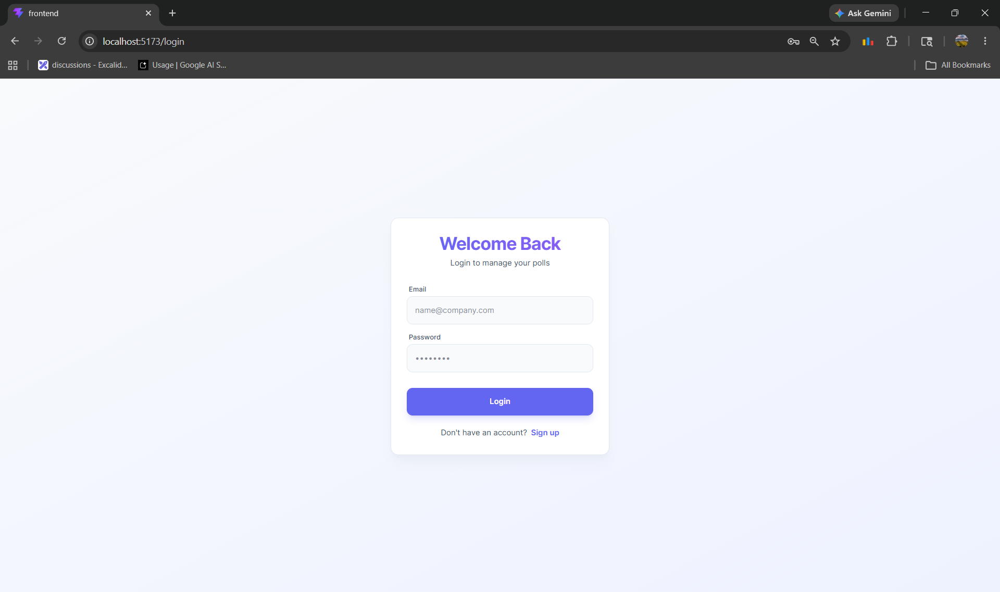
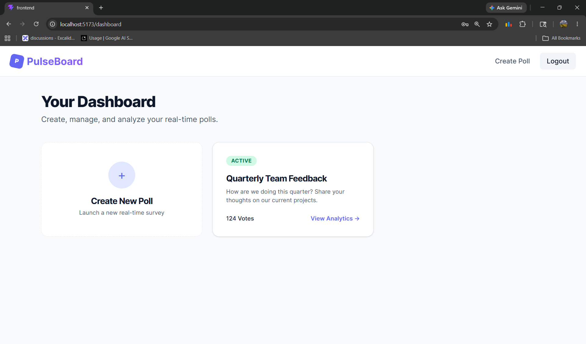
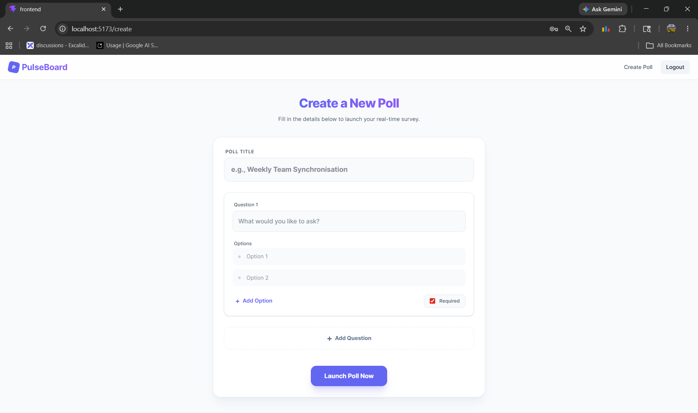
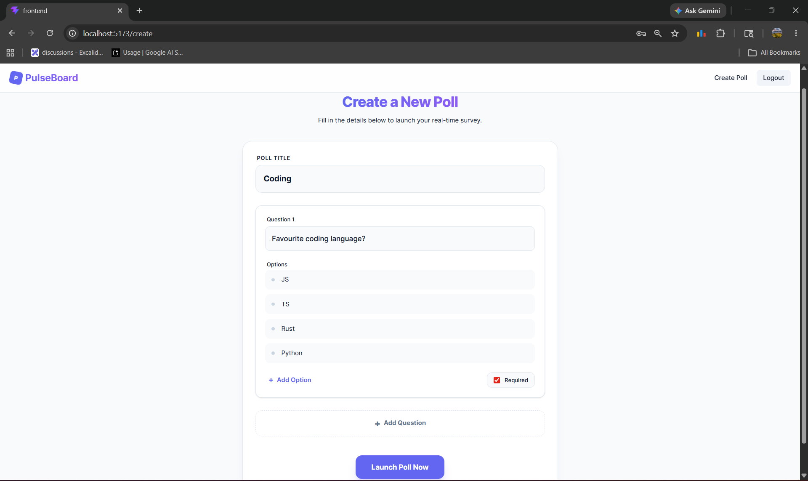

# PulseBoard - Real-Time Polling Platform

A full-stack MERN polling platform where users can create polls, share public links, collect responses and view real-time analytics in real time using Socket.io.

Built using React, Node.js, Express, MongoDB and Socket.io.

---

# Features

- JWT Authentication
- Protected Routes
- Create Dynamic Polls
- Single Option Questions
- Required & Optional Questions
- Anonymous or Authenticated Responses
- Poll Expiry System
- Public Poll Sharing
- Real-Time Analytics Updates
- Live Response Count using Socket.io
- Publish Final Poll Results
- Responsive Modern UI
- Docker MongoDB Support

---
# Screenshot






# Tech Stack

## Frontend
- React 19
- Vite
- React Router DOM
- Tailwind CSS v4
- Axios
- Socket.io Client

## Backend
- Node.js
- Express.js
- MongoDB
- Mongoose
- JWT Authentication
- Socket.io

## Database
- MongoDB (Docker)

---

# Folder Structure

```txt
pulseboard-mern/
│
├── frontend/
│   ├── src/
│   │   ├── api/
│   │   ├── components/
│   │   ├── context/
│   │   ├── pages/
│   │   ├── socket/
│   │   ├── App.jsx
│   │   └── main.jsx
│   │
│   ├── .env
│   └── package.json
│
├── backend/
│   ├── src/
│   │   ├── config/
│   │   ├── controllers/
│   │   ├── middleware/
│   │   ├── models/
│   │   ├── routes/
│   │   ├── socket/
│   │   └── server.js
│   │
│   ├── .env
│   └── package.json
│
├── docker-compose.yml
│
└── README.md
```

---

# Environment Variables

## Frontend `.env`

```env
VITE_API_URL=http://localhost:5000/api

VITE_SOCKET_URL=http://localhost:5000
```

---

## Backend `.env`

```env
PORT=5000

MONGO_URI=mongodb://localhost:27017/pulseboard

JWT_SECRET=your_secret_key
```

---

# Installation

## Clone Repository

```bash
git clone <your-repository-url>

cd pulseboard-mern
```

---

# Backend Setup

```bash
cd backend

npm install
```

---

# Frontend Setup

```bash
cd frontend

npm install
```

---

# Run MongoDB with Docker

Make sure Docker Desktop is running.

```bash
docker-compose up -d
```

---

# Run Backend

```bash
cd backend

npm run dev
```

Backend runs on:

```txt
http://localhost:5000
```

---

# Run Frontend

```bash
cd frontend

npm run dev
```

Frontend runs on:

```txt
http://localhost:5173
```

---

# API Routes

## Auth Routes

| Method | Route | Description |
|--------|-------|-------------|
| POST | /api/auth/register | Register user |
| POST | /api/auth/login | Login user |

---

## Poll Routes

| Method | Route | Description |
|--------|-------|-------------|
| POST | /api/polls | Create poll |
| GET | /api/polls/:id | Get poll |
| POST | /api/polls/:id/submit | Submit response |
| PATCH | /api/polls/:id/publish | Publish results |

---

## Analytics Routes

| Method | Route | Description |
|--------|-------|-------------|
| GET | /api/analytics/:id | Poll analytics |

---

# Real-Time Features

Socket.io is used for:

- Live response count updates
- Real-time analytics refresh
- Instant participation insights

---

# Poll Features

Users can:

- Create polls
- Add multiple questions
- Add multiple options
- Mark questions required/optional
- Enable anonymous responses
- Set poll expiry time
- Publish final results

---

# Future Improvements

- Charts & Graphs
- Dark/Light Theme Toggle
- Poll Image Support
- Email Sharing
- QR Code Sharing
- Admin Dashboard
- Rate Limiting
- AI Poll Suggestions

---

# Deployment

## Frontend
- Vercel
- Netlify

## Backend
- Render
- Railway
- Cyclic

## Database
- MongoDB Atlas

---

# Screenshots

Add project screenshots here.

---

# Author

Joy Swarnakar

B.Tech CSE Student | MERN Stack Developer

---

# License

This project is licensed under the MIT License.